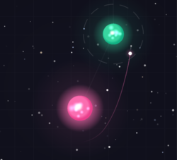

# ASTROCATCH

**[Play it in your browser →](https://astrocatch.live/)**



A one-tap browser game where you slingshot between stars. Tap
when your orbit aims at the next one. The game picks a boost,
gravity bends the path, and you get re-captured on the other
side.

## How to play

You start in a circular orbit around a star. Each star you reach
pulls you in and you orbit that one too.

- **Tap** (or press Space) to launch from your current orbit. The
  game picks the smallest boost that will reach the next star and
  fires it for you.
- **Time the tap so your direction points at the next star.** If
  no boost in the search range can reach it, the game still fires
  a default burn and you fly free, usually off into the void.
- **Release within one rotation for bonus points.** Half a rotation
  pays ×3 (Blazing), less than one full rotation pays ×2 (Quick).
- **Chain fast launches for a streak multiplier.** Consecutive
  Quick or Blazing captures build a streak that multiplies the
  bonus on each capture — starts at ×1, grows half a step per
  chain link, caps at ×4. A slow capture (or dying) breaks it.
- **Dodge planets, catch comets.** Some stars have orbiting
  planets that gently tug on your trajectory. Comets sweep
  through on highly eccentric orbits — fly close to one for
  bonus points. Binary stars orbit each other — you orbit
  their center of mass, but either sub-star can kill you.
  Occasionally a star is replaced by a black hole — same
  mechanics, but with gravitational lensing that warps the
  background around it. A black hole paired with a companion
  star pulls glowing ejecta from the donor. Rarely, a
  tumbling 3D monolith appears instead of a star.
- **Nudge your orbit** with the left/right arrow keys to
  fine-tune your trajectory before launching.
- **Help & shortcuts** — click the **?** button or press **H**
  for a pop-up cheat sheet (also pauses the game). **P**
  pauses / resumes. **W** or tapping the score toggles a
  launch-window hint that marks orbital angles where a tap
  would land a clean capture.
- **Watch your replay.** A cinematic follow-camera plays back
  your run with simplex-driven zoom behind the AGAIN button.
- **Mute anytime** via the speaker button in the top-right
  corner, or press **M**. Both the sound effects and the
  ambient music loop are generated on the fly from oscillators
  (no audio files to download). The background melody is a
  four-bar progression in A minor with a simplex-noise-driven
  lead line — so the melodic contour drifts instead of looping
  identically. Mute state is remembered between sessions.

## Run locally

ES modules cannot be loaded from `file://`, so you need a local
HTTP server. There's a tiny one bundled:

```sh
npm start          # → http://localhost:8001/
```

No build step. No `npm install`. The server uses only Node's
built-in modules. Requires Node ≥ 18.

### Browser support

Rendering is native WebGL2, no fallback. That means any browser
released in the last few years (Chrome 56+, Firefox 51+, Safari
15+, any modern Chromium on mobile). If the browser can't create
a WebGL2 context the game shows an unsupported-device screen
instead of running.

## Run tests

```sh
npm test
```

Sweeps 64 boost angles across 8 star configurations and reports
captures, escapes, and crashes. The test runner imports
`physics.js` directly, so any physics regression shows up here
before it reaches a player.

## How it works

- **Gravity is `GM/r²` from the nearest star.** Not multi-body,
  but each region produces an exact Kepler conic, so orbits are
  stable.
- **Velocity-Verlet integration** with adaptive sub-stepping
  (sub=4 near a star, sub=1 between stars), running at a fixed
  120 Hz decoupled from the screen refresh rate via a time
  accumulator. Variable-refresh monitors and RAF bursts no longer
  speed the game up.
- **Capture is by periapsis detection**, not by hitbox proximity.
  The game tracks the running minimum of `d(t)` to the target
  star and rewinds to the exact periapsis snapshot before applying
  the burn, so the resulting orbit lands at `e ≈ 0`.
- **The burn is direction-preserving.** It only scales `|v|`,
  clamping it into `[v_circ, v_max]` where `v_max` is the value
  that keeps the orbit's apoapsis inside the target's Voronoi
  cell. A neighbouring star can never steal the ball mid-orbit.
- **Boost magnitude is auto-tuned.** A 48-step search finds the
  smallest Δv that produces a clean prediction. The player picks
  *when* (the velocity direction); the game picks *how hard*.
- **Prediction matches live physics bit-for-bit.** Same
  integrator, same sub-stepping, same nearest-star rule. The
  predicted periapsis frame is the same frame the live ball
  reaches its closest approach.
- **Planets perturb, comets don't.** Some stars have 1–2
  orbiting planets that exert weak gravity on the ship. Comets
  follow analytical Kepler orbits with multi-syndyne dust tails
  and a distance-dependent coma — purely visual + scoring.
  Binary stars orbit their center of mass — gravity comes from
  the COM, but each sub-star has its own crash zone. Black holes
  play identically to normal stars but are rendered with an
  Interstellar-style accretion disk, a procedural background
  grid, and real-time gravitational lensing via a conditional
  FBO composite pass. BH binaries have physics-driven ejecta
  from the donor star. Procedural spiral galaxies drift in the
  background.
- **Rendering is WebGL2**, not Canvas2D. Five shader programs
  (fullscreen / lensing / circle / star / polyline) cover every
  primitive.
  The star is evaluated procedurally per pixel in the fragment
  shader — corona, streamers, glow, photosphere, granulation,
  core highlight — so every star stays animated without the
  Canvas2D gradient costs that used to dominate the frame budget.

## Project layout

```
docs/
  index.html         tiny shell — DOM + CSS, one <script type="module">
  gameplay.js        browser-only: state, input, orchestration
  renderer.js        browser-only: WebGL2 renderer + shader programs
  audio.js           browser-only: procedural WebAudio sound effects
  physics.js         pure physics module, used by browser and node
scripts/
  physics-test.js    node test runner
  check-distances.js standalone diagnostic for the difficulty curve
  serve.js           dependency-free local static server (serves docs/)
package.json         "type": "module" + npm scripts
```

The browser-facing game lives entirely in `docs/`, so the repo can
be published as-is via GitHub Pages with `/docs` as the source.
`https://<user>.github.io/<repo>/` will load the game with no
further configuration.

## Acknowledgements

ASTROCATCH was inspired by [STARFLING](https://playstarfling.com),
a one-tap arcade game with a similar verb. The two games share
visual style and the basic interaction. The mechanics are
different: Starfling uses parametric circular motion and
projectile flight, ASTROCATCH uses real Newtonian orbital
mechanics with periapsis detection and Hohmann-style transfers.
