# State and flows

Mermaid diagrams covering ASTROCATCH's runtime state machine, per-tick flow, capture
lifecycle, intro overlay, spawn decisions, save / resume, and challenge-link round-trip.
Mostly a cross-reference layer over the other agent_docs — read those for the
physics/rendering/audio specifics, this one for "where does control flow go".

---

## 1. Top-level state machine

Four states, defined in `gameplay.js`:

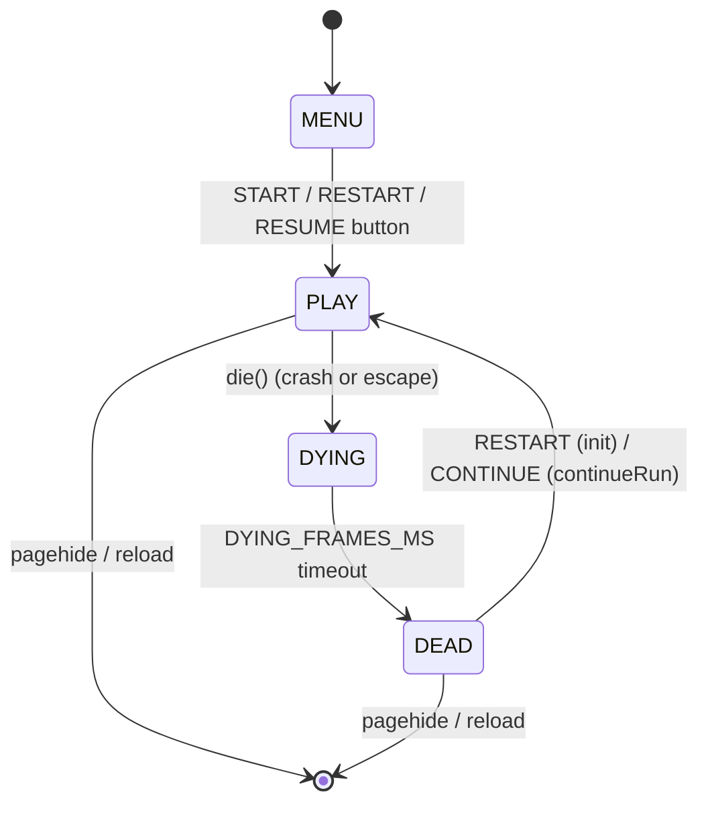

| state | renderTick? | physicsTick? | input | UI |
|---|---|---|---|---|
| `MENU` | menu-stars only (drift loop) | no | START / RESUME buttons | `#start` overlay visible |
| `PLAY` | full draw | yes | boost / pause / nudge / cinematic / hint toggles | HUD score + sub + hint |
| `DYING` | full draw (wind-down) | yes (no scoring) | ignored | HUD frozen, score snapshot |
| `DEAD` | replay-cam loop | no | RESTART / CONTINUE / Enter | `#gameover` overlay, challenge card |

`paused` is a flag on top of `PLAY` — physics + audio scheduler halt, render keeps polling
so the pause-indicator can blink and unpause is instant.

---

## 2. Entry points into a run

`init()` (fresh run), `continueRun()` (post-death retry preserving terrain), and
`resumeFromSave()` (post-reload RESUME) are the three handoffs. Only `init()` rolls a fresh
seed and rebuilds the star field.

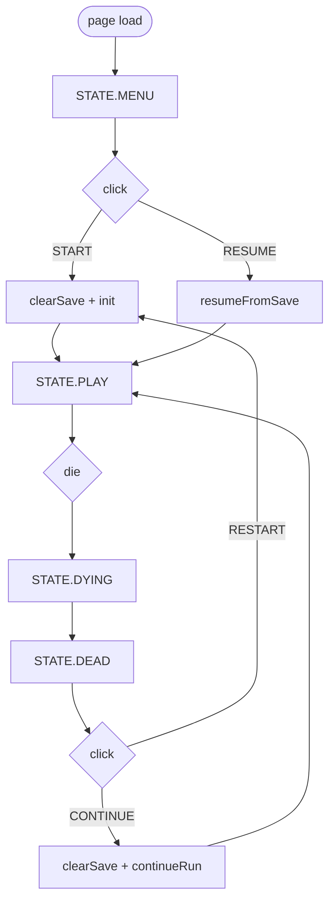

`init()` order (fresh start):

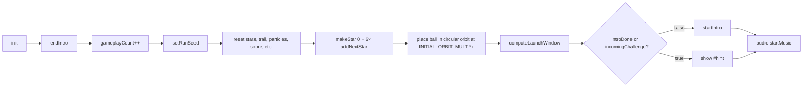

`?intro=1` forces intro regardless of done-flag, but only on `init()` paths — resume always
suppresses (existing player by definition).

---

## 3. Render / physics tick layout

Decoupled. Physics runs at `PHYSICS_HZ` (120) via an accumulator clocked by the same
`requestAnimationFrame` callback that does render work — but each RAF processes only the
backlog up to `MAX_FRAME_GAP_MS` so a tab-throttled frame can't fire a thousand physics
steps and freeze the next paint.

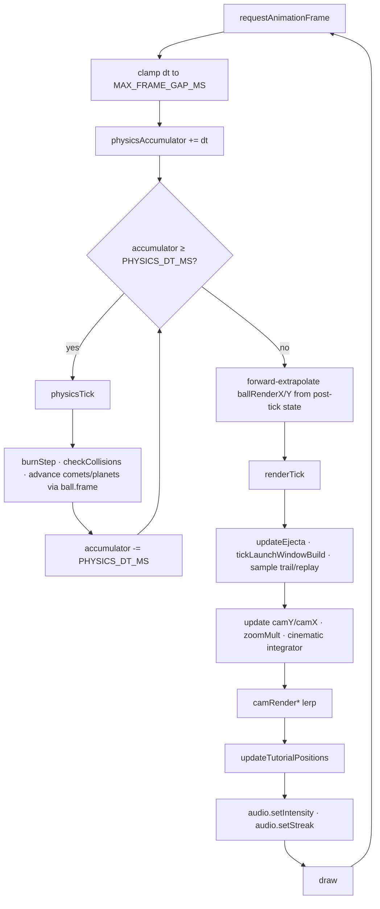

`draw()` is called from `renderTick`. It composes one `replayMat` from
`camRenderScale/Ox/Oy` and routes every world-space draw through it — same matrix in
cinematic mode and regular gameplay, so mode transitions are a lerp on the params, not a
branch in the renderer.

---

## 4. Capture lifecycle (one tap, one transfer)

The ship has three lifecycle phases under a single `STATE.PLAY`: orbiting, in transit, and
back-in-orbit. `ball.pendingCapture` is the discriminator.

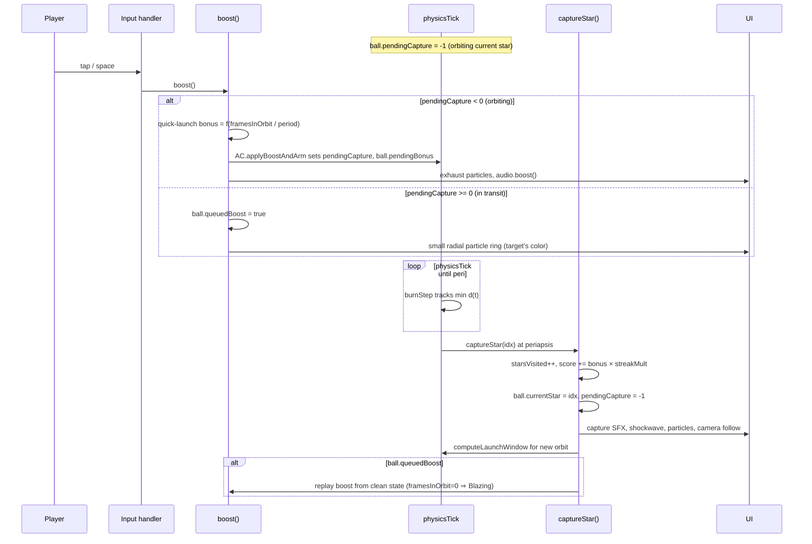

`pendingCapture` lifecycle states:

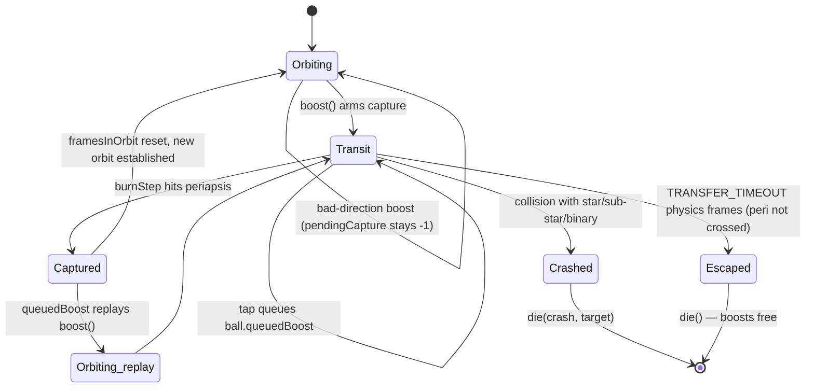

---

## 5. Star generation pipeline

`addNextStar` is the single entry point for adding stars beyond the seeded six. Three
orthogonal rolls in fixed order:

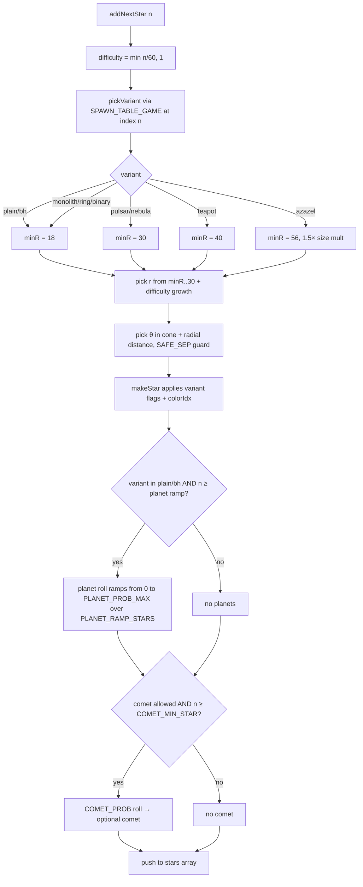

Variant comet/planet exclusions (`makeStar` decision table):

| variant | planets | comets |
|---|---|---|
| plain | ✓ | ✓ |
| binary | ✗ (sub-stars occupy volume) | ✓ |
| bh | ✓ | ✓ |
| bhBinary | ✗ | ✓ |
| monolith | ✗ | ✗ (alien/alone vibe) |
| ringworld | ✗ | ✗ |
| pulsar | ✗ (body too small) | ✓ |
| nebula | ✗ (gas occupies volume) | ✓ |
| teapot | ✗ | ✗ (Russell gag solo) |
| azazel | ✗ | ✗ (demonic vibe solo) |

---

## 6. First-run intro overlay

Two persistent DOM slots (`tutorial-current`, `tutorial-next`) bound by `ball.currentStar`.
Each entry in `INTRO_TEXTS` rides on its corresponding star index. Capture promotes the
next-text into current naturally (same string, same screen position, different element).

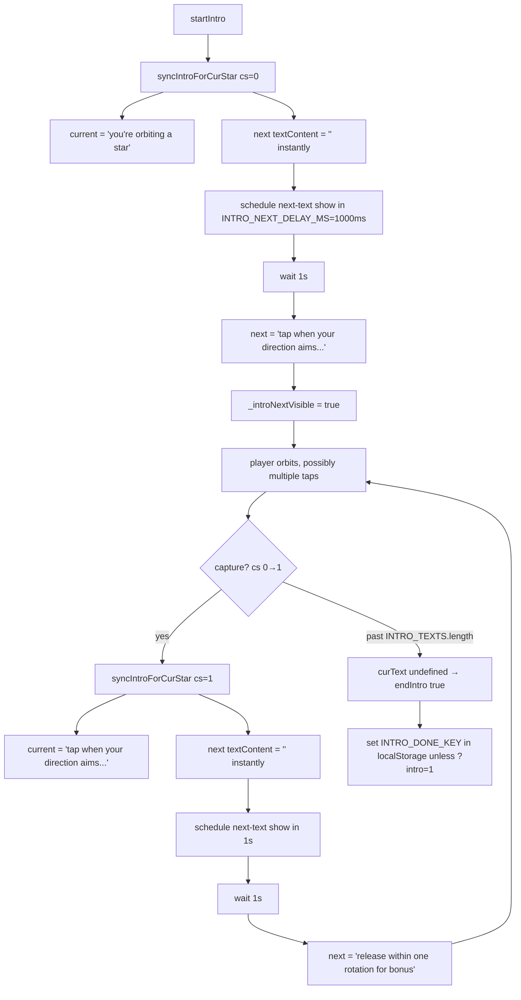

INTRO_TEXTS sequence as of current build:

| cs | text | role |
|---:|---|---|
| 0 | you're orbiting a star | teach: orientation |
| 1 | tap when your direction aims at the next one | teach: action |
| 2 | release within one rotation for bonus | teach: refinement |
| 3 | send runs as challenge links | teach: meta |
| 4 | stranger stars ahead | tease |
| 5 | enjoy | close |

`_introNextVisible` doubles as the gate for `lwForced` while `cs === 0` — so the
launch-window indicator visualises alongside the "tap when aimed" line and clears on the
first capture. The persisted `showLaunchWindow` flag isn't touched.

Dismissal paths:

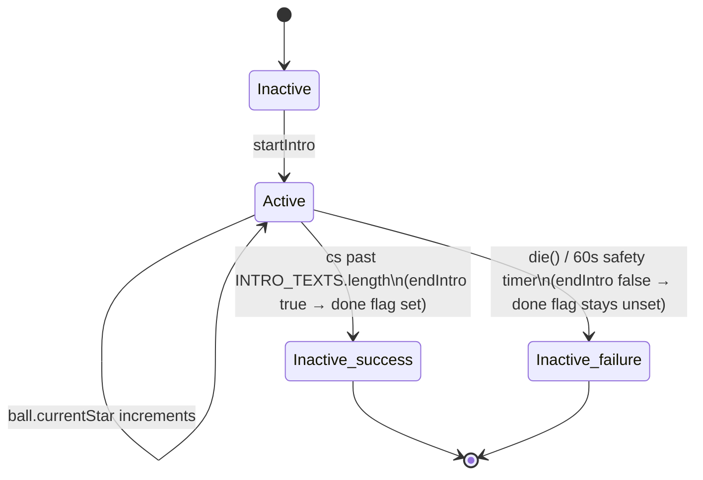

Chapter-flash overlay (variant-first + star milestone titles) is suppressed for the first
10 captures so the intro doesn't compete with the chapter UI. `_chapterMilestones`
unmarked during that window — a binary first seen at star 7 still fires its chapter flash
at the next binary past star 10.

---

## 7. Launch-window indicator build pipeline

Time-sliced across render frames with ping-pong buffers so a single 36-slot build never
spikes the frame budget.

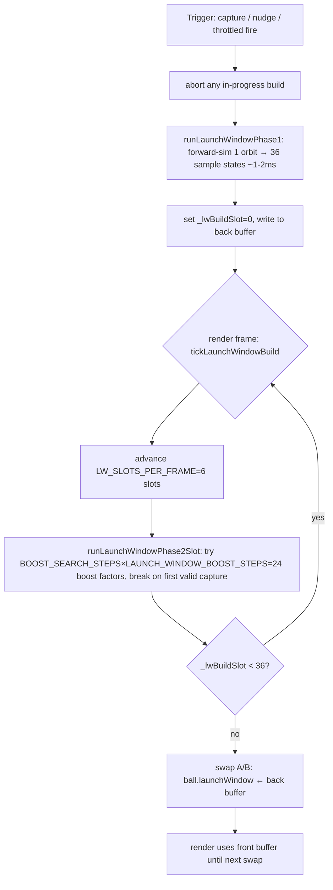

Throttled re-fire conditions (`renderTick`):

- Hint visible (`showLaunchWindow || cs.isAzazel || intro-next-tag visible`)
- Perturbation present (cs has `planets || isBinary`)
- `frame - lastLaunchWindowFrame ≥ LAUNCH_WINDOW_RECOMPUTE_FRAMES` (12 physics frames)
- No build currently in flight (`_lwBuildSlot < 0`)
- Build also auto-aborts if `pendingCapture` rises or `currentStar` rotates mid-build, so
  results computed against stale state never land.

`lwForced` overrides:
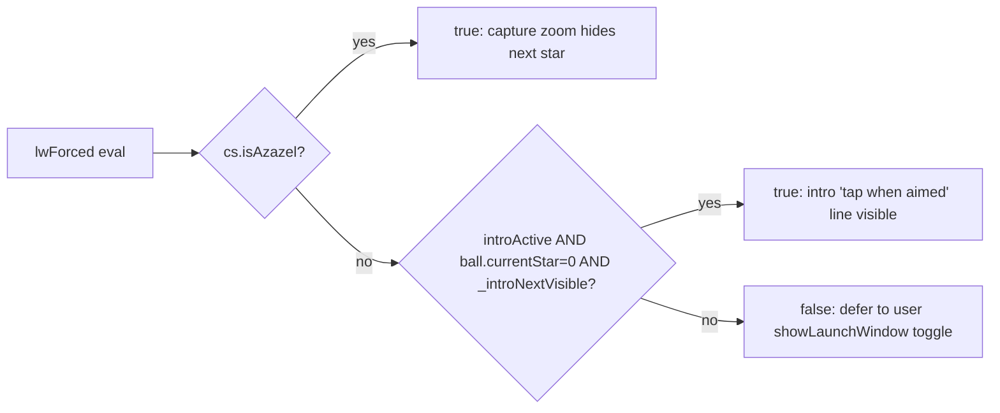

---

## 8. Challenge link round trip

Encoding happens at gameover; decoding happens at page load and on `hashchange`.

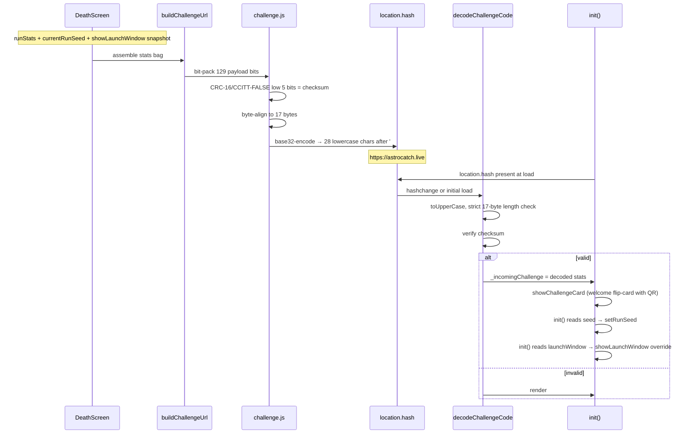

Payload bit layout (v2, total 134 bits = 17 bytes = 28 base32 chars):

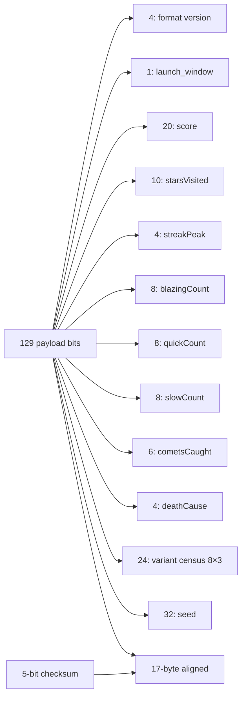

Resume-button suppression while an incoming challenge is active is critical: without it,
the player could click RESUME and `resumeFromSave()` would restore a previous run's
score, instantly clearing the sender's bar without play. Gate is
`!_incomingChallenge && !!loadGame()`.

---

## 9. Save / resume

`saveGame()` snapshots the run on death (`saveGame` is also written in `die()` so a
RESUME after a crash lands on a fresh anchor orbit, not the crash site). `clearSave()`
fires on START (fresh run) and CONTINUE (preserves the terrain, but the save is now
stale until the next death).

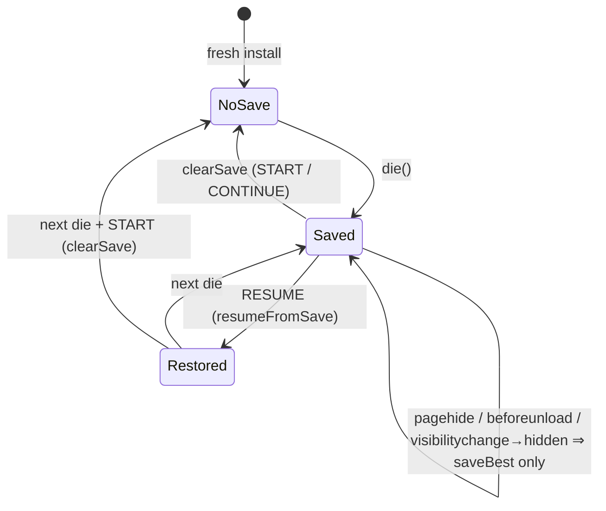

Save record fields used at restore (`SAVE_KEY = "astrocatch_savegame_v1"`):

| field | restored to | notes |
|---|---|---|
| `stars[]` | rehydrated with variant flags, planets, comets, binary data | all variant booleans round-trip |
| `ball` | repositioned to anchor's INITIAL_ORBIT_MULT orbit | not the crash-site x/y |
| `seed` | setRunSeed | so challenge URL the player generates is reproducible by recipient |
| `score`, `starsVisited`, `fastStreak`, `trackedSpeed`, `hasBoosted` | restored verbatim | |
| `frame` | restored on ball | comets/planets/binary phases resolve correctly |

---

## 10. Audio intensity + demon mode

Music intensity scales with peak-held ball speed; demon mode swaps to a Phrygian
progression while orbiting an Azazel.

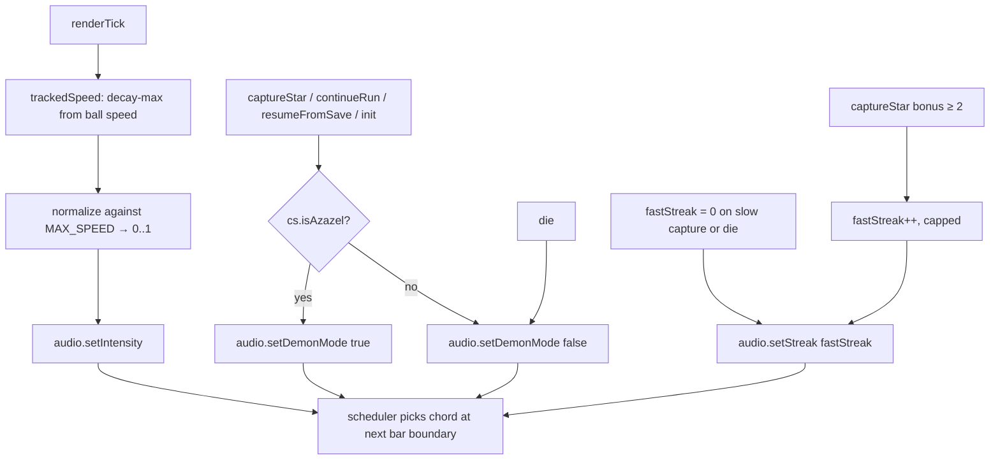

`audio.startMusic` is idempotent (called from `init`, `continueRun`, `resumeFromSave`) so
the timeline stitches across runs without a phase jump. Pause halts the scheduler via
`audio.setMusicPaused(true)`, resume re-grids onto the next bar.

---

## 11. Input → state effects

Most inputs are state-gated:

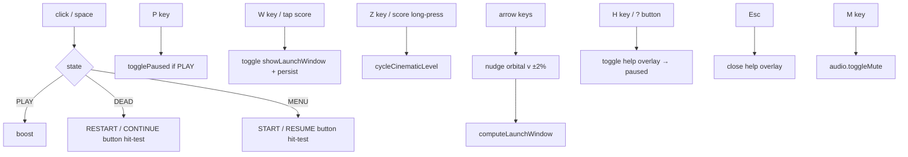

Focus-click suppression: a click within 150 ms of `window.focus` is ignored — bringing
the tab forward from behind doesn't accidentally fire a boost.

---

## 12. Cross-reference

- Physics integrator + capture math → `agent_docs/physics.md`
- Shader compilation + variant rendering → `agent_docs/rendering.md`
- Music scheduler + SFX bus → `agent_docs/audio.md`
- Per-feature gameplay detail (variants, scoring, launch-window, challenge codec, run
  titles) → `agent_docs/gameplay.md`
